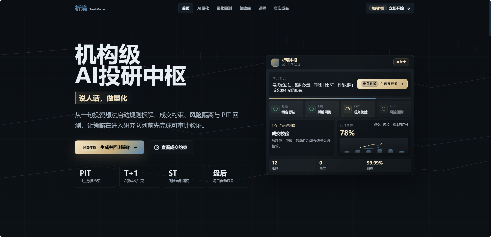
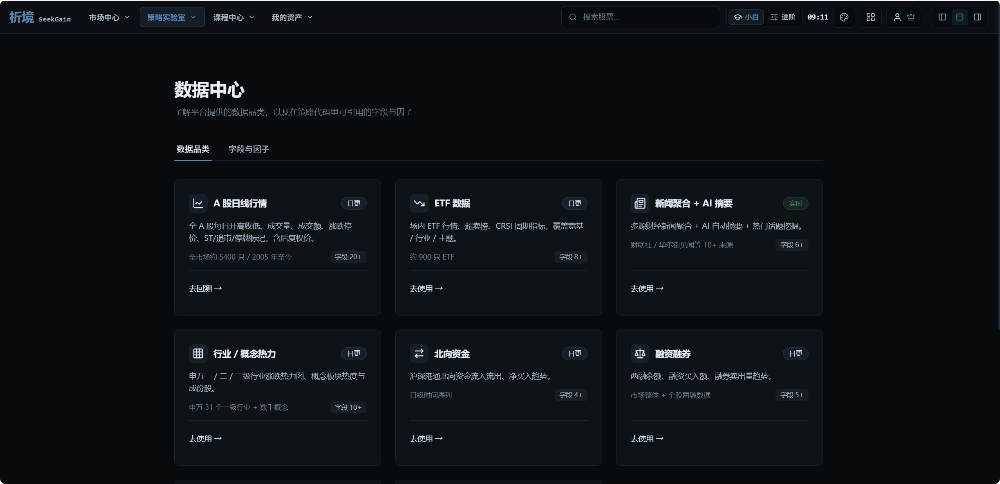
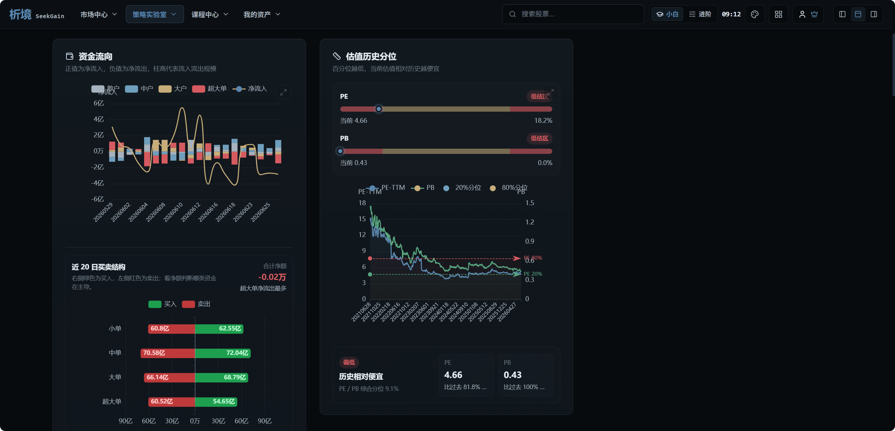

# SeekGain QuantFlow 析境 AI 量化工作流平台

## 概述

**SeekGain QuantFlow** 是析境 SeekGain 面向 A 股量化研究、策略生成、回测验证和实盘辅助的一体化 AI 量化工作流平台。平台希望降低量化交易和策略研发门槛，让主观交易者、个人投资者、学生、投研团队都能用自然语言表达策略想法，并把想法逐步转化为可运行、可复盘、可迭代的量化流程。

> 说人话，做量化。






### 核心功能

**可视化策略工作流编排**

- 基于节点和模块的策略构建流程，支持选股、择时、风控、仓位管理和技术因子组合
- 支持小白模式和进阶模式，既能快速生成策略，也能进入代码级编辑
- 策略构建、保存、一键回测、历史复盘和再次运行形成完整闭环

**AI 策略生成**

- 用自然语言描述选股条件、交易逻辑、风险控制和调仓规则
- 自动拆解为选股器、风控择时器、个股择时器、仓位管理器和技术因子草稿
- 将 AI 生成策略接入回测流程，避免只停留在文本和伪代码层面

**因子分析与回测策略验证**

- 支持 A 股策略回测、组合收益分析、交易明细和无法成交原因复核
- 接入 SeekGain Factor 因子与数据服务，支持技术指标、市场数据和 PIT 数据约束
- 按信号日、目标日、持仓日拆分数据与交易路径，贴近真实 A 股交易规则

**市场中心与复盘系统**

- 市场广度、风险热度、涨跌分布、情绪仪表盘和行业热力图
- 全球指数、A 股宽基指数、资金流向、融资融券和北向资金观察
- 为策略生成、候选池筛选和每日复盘提供市场环境参考

**会员、算力与实盘辅助**

- 支持 VIP / SVIP 权益、回测折扣、算力余额和并发能力
- 支持策略市场、我的策略、回测历史和实盘买入前检查
- 面向真实交易场景补充涨跌停、停牌、滑点、容量和成交额约束

### 适用场景

- **量化研究**：选股因子挖掘、策略开发、模型验证、组合复盘
- **AI 策略生成**：用自然语言生成可运行的选股和回测策略
- **算法交易准备**：策略回测、实盘前检查、风险过滤、持仓计划
- **金融数据分析**：市场状态判断、资金流观察、板块热度跟踪
- **投研流程沉淀**：策略模板复用、团队协作、研究过程标准化

### 技术特色

- **微服务架构**：模块化设计，便于部署、扩展和维护
- **插件化设计**：通过 `@work_node` 装饰器开发自定义工作节点
- **工作流导入导出**：支持通过 JSON 文件快速传播和复现策略流程
- **真实交易约束**：覆盖 PIT 数据、T+1、涨跌停、停牌、滑点和容量约束
- **容器化部署**：支持 Docker 和本地源码方式部署

## 已规划功能，欢迎加群内测

LLM 策略生成增强

API 代码式调用工作流

QMT 实盘交易

CTP 实盘交易

数字货币策略支持

更多策略市场模板

## 服务安装与运行

### 安装包方式（简单，快速体验）

- 如果不想花时间配置本地环境，可以使用 SeekGain 提供的线上平台或后续发布的桌面安装包。
- 安装包将尽量内置必要运行环境、示例策略和基础数据，方便快速体验策略构建、回测和市场复盘能力。
- 最新安装包和发布说明请关注 Releases 页面：

[https://github.com/SeekGainAI/seekgain_quantflow/releases](https://github.com/SeekGainAI/seekgain_quantflow/releases)

### 从源码安装（高度自定义，适合二次开发）

#### 前置条件

1. 安装 Python 3.12+ 环境，建议使用 Anaconda、uv 或虚拟环境。
2. 准备 MongoDB / Redis / MySQL 等外部服务，按实际部署环境配置连接信息。
3. 安装并启动 SeekGain Factor 相关依赖和因子服务：

```bash
git clone https://github.com/SeekGainAI/seekgain_factor.git
cd seekgain_factor
pip install -r requirements.txt
pip install -e ./seekgain_common ./seekgain_factor ./seekgain_data ./seekgain_data_hub ./seekgain_llm ./seekgain_factor_server
python ./seekgain_factor_server/seekgain_factor_server/__main__.py
```

SeekGain Factor 提供数据清洗、因子计算、因子分析、数据服务等能力，具体请查看：

[https://github.com/SeekGainAI/seekgain_factor](https://github.com/SeekGainAI/seekgain_factor)

#### 安装流程

1. 安装 SeekGain QuantFlow

```bash
git clone https://github.com/SeekGainAI/seekgain_quantflow.git
cd seekgain_quantflow
pip install -e .
```

2. 启动 SeekGain QuantFlow 服务

```bash
python src/seekgain_server/main.py
```

3. 打开 UI 图形界面

```text
策略实验室：http://127.0.0.1:8000/backtest/
市场中心：http://127.0.0.1:8000/market/
```

## 编写自定义插件

- 开发者可以在项目目录 `src/seekgain_plugins/custom/` 中编写自定义插件，并在工作流中使用
- 自定义插件需要继承 `BaseWorkNode`，并实现 `input_model`、`output_model` 和 `run` 3 个方法
- 自定义插件示例：

```python
from typing import Optional, Type
from seekgain_plugins.base import BaseWorkNode, work_node
from pydantic import BaseModel


class InputModel(BaseModel):
    """
    Define the input model for the node.
    Use pydantic to define, which is a library for data validation and parsing.

    为工作节点定义输入模型。
    使用 Pydantic 定义，Pydantic 是一个用于数据验证和解析的库。
    """
    number1: int
    number2: int


class OutputModel(BaseModel):
    """
    Define the output model for the node.

    为工作节点定义输出模型。
    """
    result: int


@work_node(name="示例-两数求和", group="测试节点")
class ExamplePluginAddition(BaseWorkNode):
    """
    Implement an example node, which can add two numbers and return the result.

    实现一个示例节点，完成简单加法运算。
    """

    @classmethod
    def input_model(cls) -> Optional[Type[BaseModel]]:
        return InputModel

    @classmethod
    def output_model(cls) -> Optional[Type[BaseModel]]:
        return OutputModel

    def run(self, input: BaseModel) -> BaseModel:
        result = input.number1 + input.number2
        return OutputModel(result=result)


if __name__ == "__main__":
    node = ExamplePluginAddition()
    input_data = InputModel(number1=1, number2=2)
    print(node.run(input_data))
```

**我们欢迎每一位用户加入节点贡献行列，共同完善 AI 量化开源生态。**

**如果有新的节点需求，也欢迎进群告诉我们。只要有助于项目发展，我们都愿意持续支持和开发。**

## 项目结构

```text
seekgain_quantflow/
├── src/                         # 所有源码
│   ├── common/                  # 通用工具和配置
│   ├── seekgain_ml/             # 机器学习组件
│   ├── seekgain_plugins/        # 插件系统
│   ├── seekgain_server/         # API 服务
│   ├── seekgain_backtest/       # 回测系统
│   ├── seekgain_trading/        # 交易执行系统
│   └── seekgain_web/            # 前端静态资源
├── user_data/                   # 用户数据目录
├── docs/images/                 # README 图片和社群二维码
├── pyproject.toml               # 项目配置和依赖
├── Dockerfile                   # Docker 配置
└── README.md
```

## 贡献

欢迎贡献代码、提出 Issue 或 PR：

- Fork 本项目
- 新建功能分支 `git checkout -b feature/AmazingFeature`
- 提交更改 `git commit -m 'Add some AmazingFeature'`
- 推送分支 `git push origin feature/AmazingFeature`
- 发起 Pull Request

## 致谢

感谢每一位关注、使用和反馈 SeekGain 的用户。

感谢所有开源社区贡献者。

## 许可证

本项目采用 AGPL-3.0 许可证。

## 加群答疑（备注【开源】更快通过）


